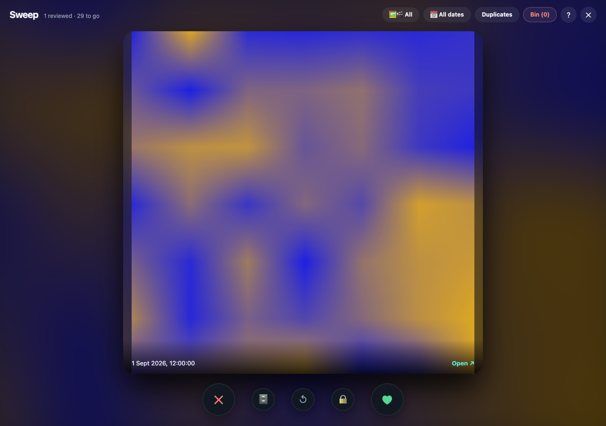
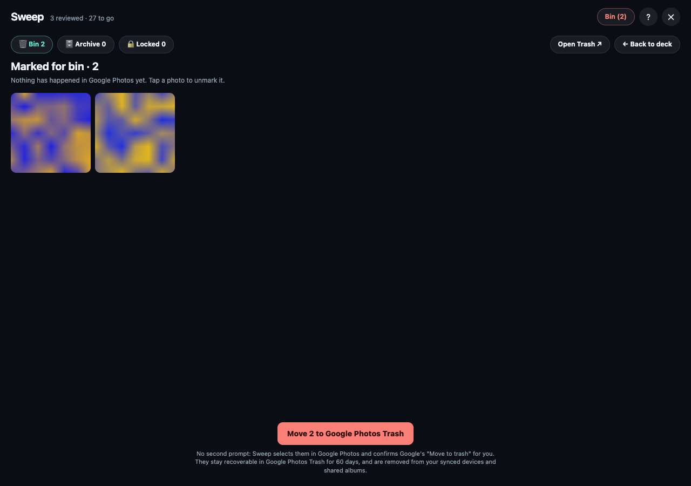
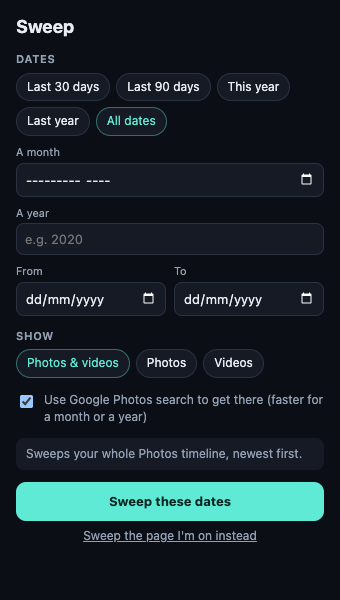

# Sweep for Google Photos

[](https://github.com/codecaliper/sweep-photos/actions/workflows/ci.yml)
[](LICENSE)

A Chrome extension for clearing out your Google Photos library quickly, one card at a time. Swipe left to bin a photo, right to keep it, up to archive it, or down to move it to the Locked Folder. It also has a duplicate finder, date and photo/video filters, and video playback on the card.

<p align="center">
  
</p>

- **Nothing changes until you confirm.** Swiping only marks photos. You review the bin, then one button moves them to Google Photos Trash, where they stay for 60 days.
- **Private:** it runs entirely in your browser, with your existing Google Photos session. There's no server, no account and no analytics. See [PRIVACY.md](PRIVACY.md).
- **Careful:** it checks Google's own "N selected" counter before acting and stops if anything looks unexpected. See [How deletion works](#how-deletion-works).

> Not affiliated with or endorsed by Google. Google Photos has no public API for deleting photos, so Sweep drives the web page the way you would. A Google UI change can break it; if it does, it stops rather than guess. It currently expects Google Photos in **English**.

## Install

**From a release (easiest):**

1. Download `sweep-photos-<version>.zip` from the [latest release](https://github.com/codecaliper/sweep-photos/releases/latest) and unzip it into a folder you'll keep.
2. Open `chrome://extensions` and turn on **Developer mode** (top right).
3. Click **Load unpacked** and pick the unzipped folder.
4. Pin Sweep from the puzzle-piece menu so its icon is in the toolbar.

**From source:** clone this repository and load the repository folder the same way. Nothing needs building.

To update, replace the folder's contents with the new release and press ↻ on the extension's card in `chrome://extensions`. Your decisions are kept.

It works in Chrome and other Chromium browsers (Edge, Brave, Arc) that allow unpacked extensions.

## Use it

1. Click the Sweep icon. A small dialog opens where you pick the dates (a preset, a month, a year, or From / To) and photos, videos or both, then press **Sweep these dates** (or `Enter`). Sweep opens Google Photos at those dates and starts the swipe deck by itself. See [Start from the toolbar](#start-from-the-toolbar).
2. To sweep an album or a search you already have open, use **Sweep the page I'm on instead** in the dialog, or press **Alt+Shift+S** on the page to open or close Sweep directly.
3. Swipe. Press `B` to review what you've marked, then **Move N to Google Photos Trash** (or Archive / Locked Folder).

Try it on 2–3 throwaway photos first.

| Input | Action |
| --- | --- |
| Drag left, two-finger swipe left, `←`, `D` | Bin (only marks the photo) |
| Drag right, two-finger swipe right, `→`, `K` | Keep |
| 🗄 button, `↑`, `A` | Mark for Archive |
| 🔒 button, `↓`, `L` | Mark for the Locked Folder |
| `Z` / `Backspace` | Undo |
| `B` | Open the bin (Bin, Archive and Locked lists) |
| `F` / "Duplicates" | Find duplicates in this view |
| `R` / "📅" chip | Set a date range for Sweep and Duplicates |
| `V` / "🖼🎬" chip | Cycle All → Videos only → Photos only |
| `Space` / `P` / ▶ | Play or pause the video on the top card |
| `Enter` / "Open ↗" | Open the photo in a new tab |
| `?` / "?" button | Shortcuts, your totals and settings |
| `Esc` | Close help, the bin or Sweep |

To change the Alt+Shift+S shortcut, go to `chrome://extensions/shortcuts`.

<p align="center">
  
</p>

The first time you open Sweep, the help panel appears. It also shows how many photos you've kept, marked and trashed, and has two resets:

- **Review kept again** forgets your keep decisions, so those photos come back to the deck.
- **Clear duplicate cache** forgets saved thumbnail fingerprints.

The toolbar icon shows a red badge with the number of items waiting in the bin, including those marked for Archive or the Locked Folder.

## Start from the toolbar



Clicking the toolbar icon opens a dialog, so you don't have to set dates on the page first:

- **Dates:** Last 30 days, Last 90 days, This year, Last year, All dates, a month, a year, or custom From / To dates. The dialog remembers your last choice, and it's the same range as the 📅 chip.
- **Show:** photos and videos, photos only, or videos only.
- **Use Google Photos search** (on by default): for a single month or a single year, Sweep opens Google's own search for it, such as `photos.google.com/search/January 2020`, which loads just that period. Sweep's date filter still trims the deck to the exact days.
- Anything else (a range across years, or open-ended) opens the main timeline, and Sweep jumps to the range there (see [Date range](#date-range)). The line above the button tells you which will happen.
- If Google's search finds nothing (for example, a language where "January 2020" isn't understood), Sweep falls back to the timeline and says so. This takes up to 10 seconds, while it waits for results.
- **Sweep the page I'm on instead** keeps the album or search you have open and just applies the dates and media choice.

The dialog closes as soon as Google Photos takes focus; the extension's background worker finishes the job. It uses the current tab if it's already on Google Photos, otherwise it opens a new one.

<br clear="right">

## Archive and Locked Folder

Besides bin and keep, a card can be marked for **Archive** (🗄, `↑` or `A`; the card flies up) or the **Locked Folder** (🔒, `↓` or `L`; the card drops down). Like the bin, this only marks it. `B` opens the bin, which has three tabs (🗑 Bin, 🗄 Archive, 🔒 Locked), each with its own button to carry out that list.

- **Archive** selects the photos in Google Photos and uses Google's ⋮ → Archive, or Shift+A if the menu item isn't there. There's no dialog. Archived photos leave the Photos timeline but stay in albums, search and Google's Archive page.
- **Locked Folder** uses ⋮ → Move to Locked Folder and presses only Google's "Move" in a dialog about the Locked Folder. If Google asks for anything else, such as verifying it's you, Sweep leaves the dialog for you to answer. Locked items leave your library, albums and shared albums.
- It is checked the same way as trashing: Google's "N selected" count must match, the selection must clear, and for the Locked Folder the photos must leave the grid.
- Photos marked in another view are done one by one from each photo's own page, in the background tab. A photo whose ⋮ menu already offers Unarchive counts as already archived.

While Sweep is open it blocks all keystrokes from reaching the page. Google Photos' own shortcuts, such as `#` for delete, can't fire underneath it.

## Duplicate finder

**Duplicates** scrolls through the current view (up to 3,000 items) and fingerprints each thumbnail with a 64-bit perceptual hash (dHash). It then groups photos that look alike. Each group is shown side by side. The first photo is proposed as keep and the rest as bin, and you can click any photo or press its number to switch it.

| Key | Action |
| --- | --- |
| `1`–`9` / click | Switch that photo between keep and bin |
| `Enter` | Apply and go to the next group |
| `A` | Keep all (not duplicates) |
| `S` | Skip (asked again next scan) |
| `Z` | Previous group (undoes it) |

- **Similar: on** (default, ≤10 bits apart) also catches burst shots and near-identical frames. **Off** (≤4 bits) catches only re-uploads and re-encodes.
- Binned duplicates go into the same bin as swipes. Nothing is deleted until you trash the bin.
- A group you've reviewed isn't offered again, unless a new look-alike joins it.
- It compares *thumbnails*, so it can't tell resolutions apart. Check which copy you're keeping with "Open ↗".
- Flat images, such as all-black photos or blank screenshots, have no fingerprint signal and are ignored.

Hashing runs in the service worker. It fetches `=w64-h64` thumbnails from `*.googleusercontent.com`, which the extension's host permission allows; a page script would get a tainted canvas instead. Fingerprints are cached by photo ID in `chrome.storage.local`, so later scans are fast.

## Videos

Video cards show a ▶ button. Press it, or `Space` / `P`, to play the video right on the card. You can still swipe while it plays; the bottom strip is left for the player's controls.

Sweep streams the video from Google's servers using your signed-in session. It starts buffering as soon as a video card reaches the top, so play starts almost at once. It tries 720p first (it fills the card and starts sooner than 1080p), then 1080p, 360p and the original file, and remembers which size worked so later videos ask for that one first. If none of them loads, the card offers **Play in Google Photos ↗** instead.

The 🖼🎬 chip (or `V`) switches between **All**, **Videos only** and **Photos only**. This filter works together with the date range, applies to Duplicates as well, and is remembered between sessions. Photos and videos are told apart by Google's tile label ("Video - …").

## Date range

Press `R` or click the 📅 chip to pick a range: Last 30 days, Last 90 days, This year, Last year, All dates, or custom From / To dates (either side can be left open, and the To day is inclusive). The range applies to both the swipe deck and the duplicate scan, and is remembered between sessions.

- Dates come from each thumbnail's aria-label (English en-GB and en-US formats only). Items with no readable date are left out while a range is set.
- On a newest-first page (the main timeline) Sweep jumps straight to the range. Google Photos has no date URL, so Sweep binary-searches the scroll position: it checks the middle of the timeline, then halves the gap, which takes about a dozen quick probes even for years of photos. It then loads forward from just before the range, and stops loading once it passes the start date. Moving marked photos to Trash jumps the same way, to the newest marked date. Each check only reads the tiles actually on screen, and waits until they stop changing, because Google keeps screens of tiles rendered off-screen and old ones linger after a jump. The page console shows each check as `[sweep] seek probe …` and the total as `[sweep] seek: N probes … in N ms`. On oldest-first albums it just filters, without jumping or stopping early.
- Changing the range keeps your decisions and restarts loading from the top of the page.

## How deletion works

Deletion follows the same two steps as the Android app, and you can undo it:

1. Swiping left only **marks** a photo. Google Photos doesn't change.
2. Marked photos go into the bin. You can review them there and unmark any you want to keep.
3. **Move N to Google Photos Trash** is the one confirmation. Sweep scrolls the grid and ticks each marked photo's checkbox. It then checks that Google's "N selected" counter matches, presses Google's trash button, and **clicks "Move to trash" in Google's dialog for you**. Photos stay in Google Photos Trash for 60 days. They're also removed from synced devices and shared albums, which is what Google's dialog warns about.

Albums don't show a trash icon when photos are selected, so Sweep tries three routes in order:

1. Google's toolbar trash icon (library, search, favourites).
2. **⋮ More options → Move to trash / Move to bin**. This is how albums work. Sweep never clicks "Remove from album" or anything with "album" or "permanent" in its label.
3. Google's own `#` keyboard shortcut.

A route only counts once Google actually responds, meaning its dialog opens or the selection clears; otherwise Sweep tries the next one. Each step is logged to the page console with a `[sweep]` prefix.

If none of them works, the photos stay selected and Sweep asks you to finish the trash yourself.

Big bins are trashed in batches of 100. Each batch is selected, checked against Google's counter, trashed and verified before the next one starts. If a batch fails, the batches already moved stay recorded and the rest stay marked.

Sweep refuses to start when:

- Google Photos already has a selection (it would be trashed too)
- a Google dialog is already open
- you're on the Trash page
- Google's "N selected" counter can't be read or doesn't match what Sweep ticked (it fails closed and leaves the selection for you to check)

Trashing from an album deletes the photo from your whole library, not just from that album.

The auto-confirm clicks only a button labelled exactly "Move to trash" or "Move to bin". If Google shows anything else, such as a **Delete permanently** dialog for items that aren't backed up, Sweep leaves it for you to answer.

Afterwards Sweep checks the page to see what actually happened, the same way the Android app re-queries MediaStore. The photos must have left the grid and the selection must be cleared. If either check fails, the trash counts as cancelled and everything stays marked.

Marked photos that the grid on this page can't reach are trashed **one by one from each photo's own page** instead. This happens when they were marked in another album or view. Nothing pops up: each photo's page (`photos.google.com/photo/<id>`) loads in an inactive tab, tucked into a collapsed **Sweep** tab group. Sweep presses Google's own trash button there, confirms only "Move to trash", and checks that Google moved on from that photo. It's slower (a few seconds per photo), and there's a **Stop** button.
- A photo whose page shows **Restore** is already in Trash. It's recorded as trashed and never touched.
- Chrome throttles background tabs. If a photo's page doesn't react there, Sweep retries that photo in a small window and keeps using the window for the rest of that run. The retry is safe: a photo that already went to Trash shows Restore.
- If Google asks anything else, such as Delete permanently, Sweep stops and switches to that tab so you can answer.

Sweep also bounds its search of the grid, so it never scrolls a whole library. It stops scrolling when:

- it has passed the date of the oldest marked photo (on the main timeline)
- it has scrolled 80 times without meeting a marked photo
- Google won't let it tick photos
- you press **Stop searching**

Anything it didn't find is done one by one. Photos Sweep knows were marked in another view skip the grid search entirely.

The bin also says how many were marked in another view, with links to open those views so you can use the faster grid route there.

If a photo can't be found at all, it stays marked. For example, Google may have deleted it. The bin then offers **Clear N not found** and an **Open Trash ↗** link so you can check. Cleared photos are treated as trashed, so any that are still in your library come back into the deck.

If a trashed photo shows up again in a later session (for example, you restored it), it goes back into the deck for a fresh decision.

## Why it drives the web UI

Google Photos has no public API for deleting photos from your library. The broad library-read scopes were also withdrawn in March 2025. So the extension does what a person would do in the web UI. All of Google's markup handling is in `src/photos-dom.js`, and it uses stable hooks rather than generated class names:

- grid items are `a[href*="photo/"]` links, and their `aria-label` reads like `Photo - Landscape - <date>`
- thumbnails are `googleusercontent` URLs, and Sweep rewrites the `=wNNN-hNNN` suffix to get a full-size image for the card
- selection uses `[role="checkbox"]`, and the trash button is matched by its `aria-label` ("Move to trash", "Move to bin" or "Delete")

**If Google changes its UI, this is the file to fix.** Some text matching assumes an English interface: the "N selected" counter and the trash button label. If Sweep can't find the trash button, it leaves the items selected and asks you to finish in Google Photos yourself.

Google Photos enforces Trusted Types, so the overlay builds its DOM with a small `h()` helper and never uses `innerHTML`. The overlay sits in a shadow root so the page's CSS can't affect it.

## Files

- `manifest.json`: MV3 manifest, limited to `photos.google.com`
- `popup.html` / `popup.css` / `popup.js`: the toolbar dialog (dates, media, start)
- `background.js`: starts Sweep from the dialog (search URL or timeline, with fallback), the Alt+Shift+S toggle, injects into tabs that were already open, and hashes thumbnails
- `content.js`: small classic script that lazy-loads `src/main.js` as an ES module
- `src/deck.js`: pure deck state (keep, bin, undo, unmark, duplicate groups, basket, trashed), with no DOM
- `src/dates.js`: pure date-label parsing, range bounds, presets and scroll-skip checks
- `src/messaging.js`: page-to-worker messaging that retries while Chrome restarts an idle service worker
- `src/dupes.js`: pure dHash, Hamming distance and grouping, shared by the worker and the page
- `src/photos-dom.js`: Google Photos adapter (read grid, harvest by scrolling, select, trash)
- `src/overlay.js` / `overlay.css`: swipe card stack and bin UI
- `src/main.js`: orchestration and persistence
- `icons/`: toolbar icons, drawn by `npm run icons`
- `tools/`: static checks, the release zip builder and the list of files that ship (`runtime-files.mjs`)
- `e2e/`: real-Chrome end-to-end tests against a local mock of Google Photos
- `docs/`: README screenshots, taken from the e2e mock

## Development

Node 20 or newer. The extension itself has no dependencies and no build step: edit the files and press ↻ in `chrome://extensions`.

```bash
npm run check     # manifest, file references, syntax and imports
npm test          # unit tests: deck logic, URL and label parsing, hashing, grouping, the confirm rules
npm run package   # dist/sweep-photos-<version>.zip, with only the files Chrome needs
```

### End-to-end

```bash
(cd e2e && npm ci)   # puppeteer and Chrome for Testing
npm run e2e          # every scenario
cd e2e && node run.mjs album   # only scenarios whose name contains "album"
HEADFUL=1 npm run e2e          # watch it
```

This loads the unpacked extension into Chrome for Testing and points `photos.google.com` at a local mock through a proxy, so no real account is touched. The mock copies the parts of Google Photos that Sweep relies on: a virtualised grid, checkboxes, the "N selected" counter, the toolbar and album ⋮ trash routes, the confirmation dialogs and the Trusted Types CSP.

The scenarios cover swiping, trash from the library and from albums, batching, archive and the Locked Folder, the safety refusals, the duplicate finder, date ranges, the toolbar dialog (Google search, fallback and "the page I'm on"), videos, help, trackpad swipes and the badge. Any page error fails the run.

The real site can still differ from the mock, so try a small batch of 2–3 throwaway photos after Google changes its UI.

CI runs the checks, unit tests and every e2e scenario on each push and pull request. Pushing a `v<version>` tag that matches `manifest.json` publishes a GitHub release with the zip.

## Contributing

Issues and pull requests are welcome. See [CONTRIBUTING.md](CONTRIBUTING.md). The most useful reports are when Sweep stops working after a Google Photos change: include what you pressed, what Sweep said, and the `[sweep]` lines from the page console (`F12` → Console).

## License

[MIT](LICENSE)
